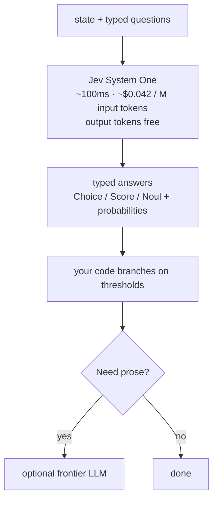
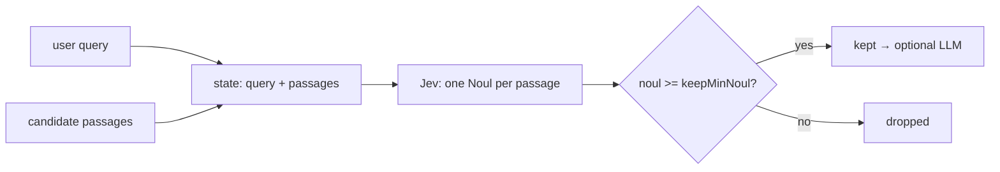
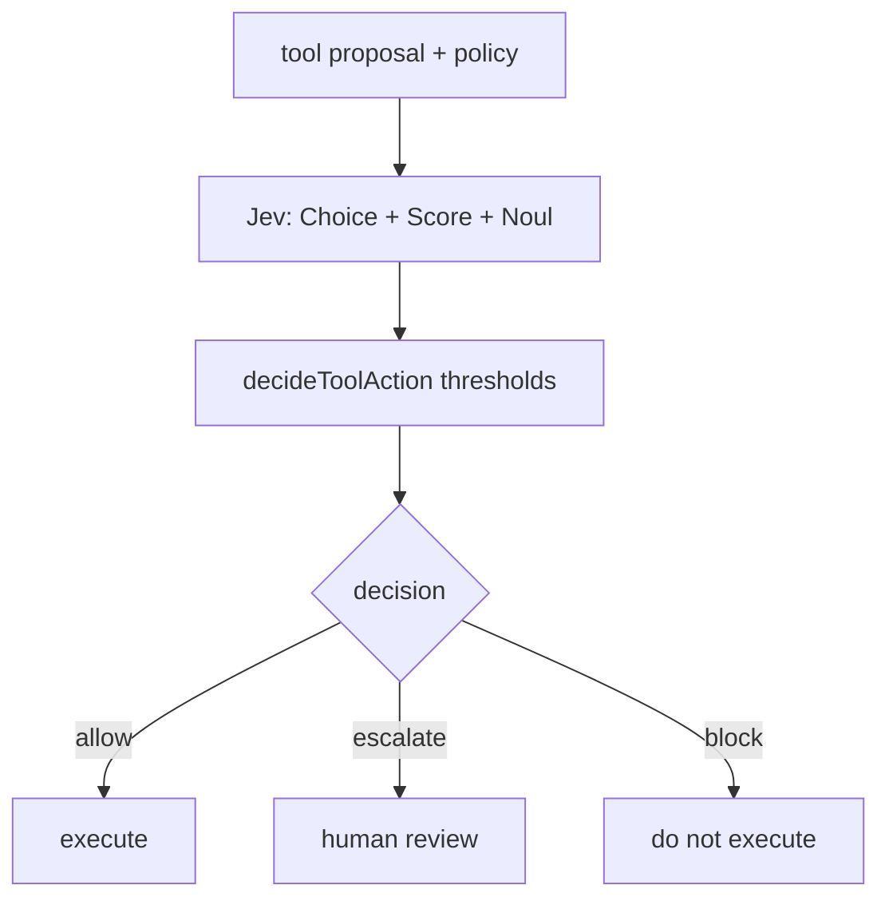
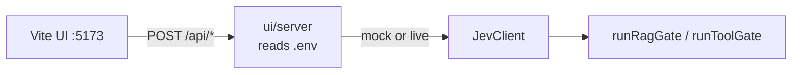
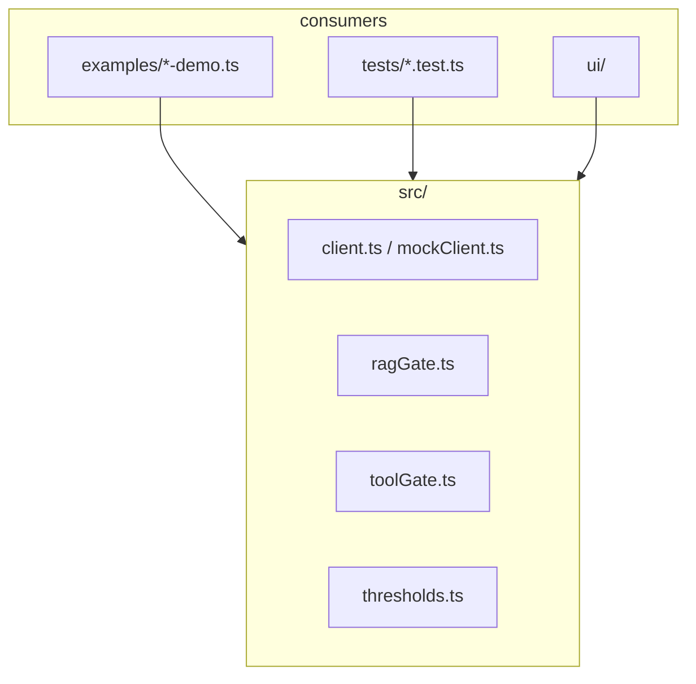

# tru-jev-harness

[](./LICENSE)
[](https://nodejs.org/)
[](https://www.typescriptlang.org/)

Open-source TypeScript harness from [TruFyre Technologies](https://trufyre.ai/) ([TruFyre Labs](https://github.com/trufyrelabs)) that puts [TypeSafe AI **Jev**](https://typesafe.ai) in front of two expensive agent steps:

1. **RAG relevance gate:** score candidate passages with Jev **Noul** and keep only high-relevance chunks *before* any LLM generation.
2. **Tool risk gate:** score a tool proposal with **Choice** + **Score** + **Noul**, then let *your code* return `allow` | `escalate` | `block`.

Jev does **not** generate text. It evaluates a `state` against typed questions and returns structured answers your code can branch on.

> **No API key required to explore.** Mock mode (`--mock` / `JEV_MOCK=1`) runs the full demos, tests, and UI with a deterministic fake client.

**Package:** `tru-jev-harness` · **License:** MIT · **Author:** TruFyre Technologies Pty Ltd

---

## Table of contents

- [Why this exists](#why-this-exists)
- [How it works](#how-it-works)
- [Quick start](#quick-start)
- [Gates in detail](#gates-in-detail)
- [Library API](#library-api)
- [Interactive UI](#interactive-ui)
- [Scripts](#scripts)
- [Repository layout](#repository-layout)
- [Alternate path: Vercel AI Gateway](#alternate-path-vercel-ai-gateway--ai-sdk)
- [Contributing](#contributing)
- [License](#license)

---

## Why this exists

Retrieval and tool-use are where agents waste money and take irreversible actions.

| Problem | Gate | Outcome |
| --- | --- | --- |
| Embedding search is cheap but noisy; answering over junk chunks is expensive | RAG gate | Drop low-noul passages before generation |
| An LLM proposing `delete_record` is not a permission | Tool gate | Calibrated `allow` / `escalate` / `block` from thresholds |

This repo is **fixtures + gates** plus a Vite playground. No chatbot, no vector database, no LangChain. Use it as a reference implementation or import the gates into your own agent stack.

---

## How it works

Jev is TypeSafe's **System One** model: one `POST` evaluates many named questions in parallel against the same state. Model alias: `jev-latest`. Docs: [docs.typesafe.ai](https://docs.typesafe.ai/).



| Primitive | Question | Returns |
| --- | --- | --- |
| **Noul** | Is this statement true? | `noul` in `[0, 1]` (P(yes)). No separate `confidence` field. |
| **Choice** | Which option? | `choice`, `probabilities`, `confidence` |
| **Score** | Where on this rubric? | `score`, `legend`, `probabilities`, `confidence` |

Public figures from TypeSafe ([models](https://docs.typesafe.ai/models), [launch post](https://typesafe.ai/blog/introducing-system-one-models-and-jev)):

- **Price:** about $0.042 / million input tokens ($42 / billion). Output tokens are free.
- **Latency:** on the order of ~100ms.
- **Context:** 64k tokens per request (32k for `state` plus the longest question).

Depends on [`@typesafe-ai/sdk`](https://www.npmjs.com/package/@typesafe-ai/sdk) (`TypeSafeClient.systemOne`, helpers `noul` / `choice` / `score`).

---

## Quick start

**Requirements:** Node 20+, ESM.

```bash
git clone https://github.com/trufyrelabs/tru-jev-harness.git
cd tru-jev-harness
npm install
```

### Mock mode (recommended first)

Reviewers and contributors can run everything without TypeSafe credentials:

```bash
npm test
npm run demo:rag -- --mock
npm run demo:tool -- --mock
```

Equivalent: `JEV_MOCK=1 npm run demo:rag`.

### Live Jev

```bash
cp .env.example .env
# paste TYPESAFE_API_KEY=...  from https://console.typesafe.ai/settings/keys
npm run demo:rag
npm run demo:tool
```

If `TYPESAFE_API_KEY` is missing and you did not pass `--mock`, the CLI exits with a clear error. **Never commit `.env`.**

Fixtures are a fictional AU retailer (**Bluegum Outfitters Pty Ltd**, Sydney): a Brunswick VIC duplicate-GST ticket, ACL/GST knowledge-base passages, and tool proposals (`lookup_order`, `send_email`, `refund`, `delete_record`).

### Use as a library

```ts
import { createJevClient, runRagGate, runToolGate } from "tru-jev-harness";
```

---

## Gates in detail

### RAG relevance gate

One batched Jev call: each candidate passage is a **Noul** ("is this relevant?"). Code keeps only passages with `noul >= keepMinNoul`.



```ts
await runRagGate(client, { query, passages }, { thresholds: { keepMinNoul: 0.8 } });
```

Noul answers have **no** `confidence` field ([TypeSafe docs](https://docs.typesafe.ai/confidence)); the RAG gate thresholds on `noul` (P(relevant)).

### Tool risk gate

Before an agent runs a side-effecting tool, Jev scores **Choice** (disposition), **Score** (risk), and **Noul** (policy fit). Deterministic policy in this repo maps those answers to a decision ([confidence routing](https://docs.typesafe.ai/patterns/confidence-routing)).



```ts
await runToolGate(client, { proposal, policy }, {
  thresholds: { allowMinConfidence: 0.9, maxAllowRisk: 1.0 },
});
```

Defaults live in `src/thresholds.ts` and can be overridden per call. **Jev proposes; your code decides.**

---

## Library API

```ts
import {
  createJevClient,
  runRagGate,
  runToolGate,
  DEFAULT_RAG_THRESHOLDS,
  DEFAULT_TOOL_THRESHOLDS,
} from "tru-jev-harness";

const client = createJevClient({ mock: true }); // or live, reading TYPESAFE_API_KEY

const rag = await runRagGate(client, { query, passages });
// rag.kept → only passages with noul >= keepMinNoul

const tool = await runToolGate(client, { proposal, policy });
// tool.decision → "allow" | "escalate" | "block"
```

`JevClient` is a thin wrapper around `TypeSafeClient.systemOne`. Unit tests inject a mock; they never call the live API.

---

## Interactive UI

A Vite playground under `ui/` runs the same gates with the Bluegum fixtures. The API key stays on the server (repo-root `.env`); the browser never sees it.

```bash
npm run ui:install
npm run ui
```

Open http://localhost:5173. Mock mode works with no key. With `TYPESAFE_API_KEY` set, uncheck **Mock Jev** to call live Jev.

The **What this is** panel at the top of the page summarizes the playground. Expand **How it works** for the cascade and both gates as flowcharts.



---

## Scripts

| Script | Purpose |
| --- | --- |
| `npm test` | Vitest, mocked Jev only |
| `npm run demo:rag` | RAG gate CLI (`--mock` supported) |
| `npm run demo:tool` | Tool gate CLI (`--mock` supported) |
| `npm run ui` | Interactive Vite playground |
| `npm run ui:install` | Install UI dependencies |
| `npm run ui:build` | Build the UI |
| `npm run typecheck` | `tsc --noEmit` |
| `npm run build` | Emit `dist/` |

---

## Repository layout

```
src/           client wrapper, ragGate, toolGate, types, thresholds
examples/      rag-demo, tool-demo, AU fixtures
tests/         gate logic with a scripted/mock Jev client
ui/            Vite playground for RAG + tool gates
```



---

## Alternate path: Vercel AI Gateway / AI SDK

This repo talks to TypeSafe's native endpoint via `@typesafe-ai/sdk` (`TYPESAFE_API_KEY`, `POST /v1/systemone`, model `jev-latest`).

You can instead call Jev through [Vercel AI Gateway](https://vercel.com/docs/ai-gateway/modalities/evaluation) with the AI SDK 7+ `experimental_evaluate` API. Gateway model id is `typesafe-ai/jev`. The SDK maps TypeSafe **Noul** to a `boolean` question (`probability` in the answer):

```ts
import { experimental_evaluate as evaluate } from "ai";

const result = await evaluate({
  model: "typesafe-ai/jev",
  state: { query: "...", passage: "..." },
  questions: {
    relevant: {
      type: "boolean",
      instructions: "Is this passage relevant to the query?",
    },
    disposition: {
      type: "choice",
      instructions: "What should the agent do?",
      criteria: {
        allow: "Execute automatically",
        escalate: "Human review",
        block: "Do not execute",
      },
    },
  },
});
```

Direct TypeSafe provider: [`@ai-sdk/typesafe-ai`](https://ai-sdk.dev/providers/ai-sdk-providers/typesafe-ai) (`TYPESAFE_AI_API_KEY`, `typeSafeAi.evaluationModel("jev-latest")`). Same primitives; different packaging. Prefer the native SDK in this harness so CI never depends on a Gateway token.

---

## Contributing

Contributions are welcome. A good loop:

1. Fork and clone; run `npm install`.
2. Use **mock mode** for local work (`npm test`, demos with `--mock`).
3. Keep changes focused: gates, thresholds, fixtures, docs, or UI.
4. Run `npm test` and `npm run typecheck` before opening a PR.
5. Open a PR against `main` with a short "why" and how you verified it.

**Ideas that help:** clearer fixtures, threshold presets, more gate examples, docs polish, UI ergonomics. Please do not commit secrets (`.env`, API keys).

Issues: [github.com/trufyrelabs/tru-jev-harness/issues](https://github.com/trufyrelabs/tru-jev-harness/issues).

---

## License

MIT © [TruFyre Technologies Pty Ltd](https://trufyre.ai/)

- Homepage: https://trufyre.ai/
- Repository: https://github.com/trufyrelabs/tru-jev-harness
- Jev / TypeSafe: https://typesafe.ai · https://docs.typesafe.ai
